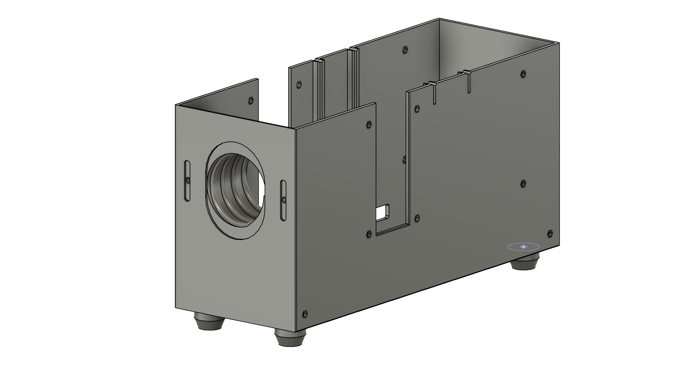
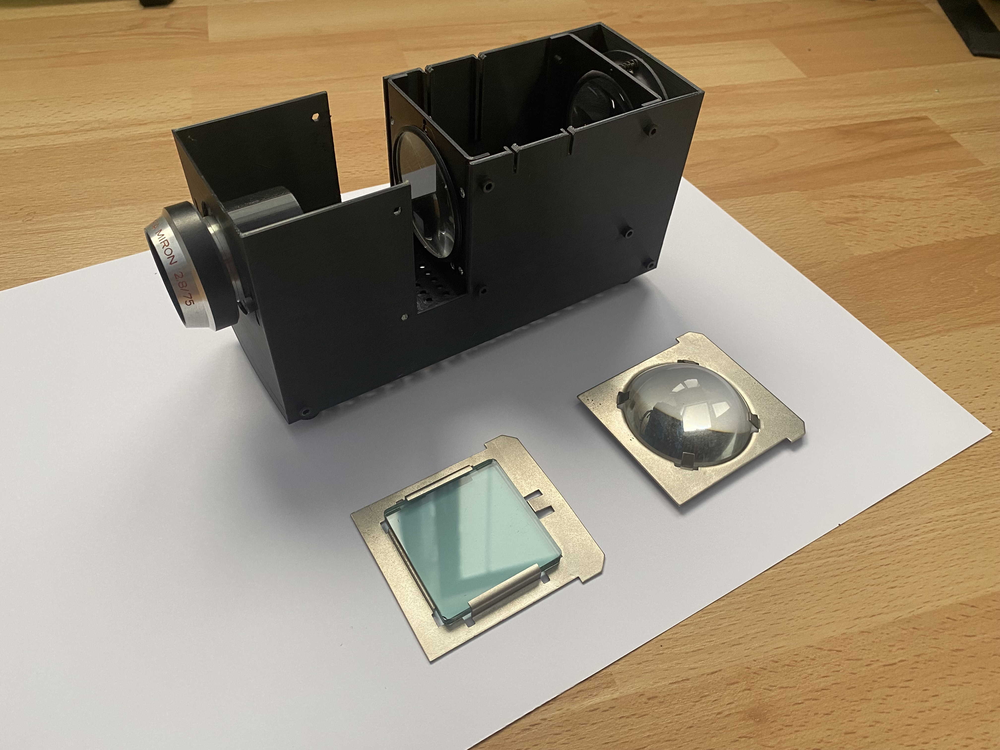
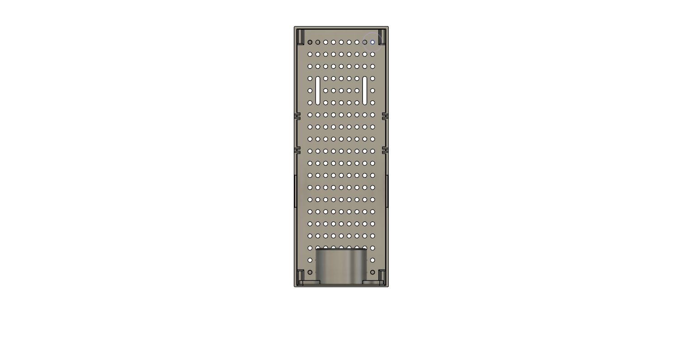
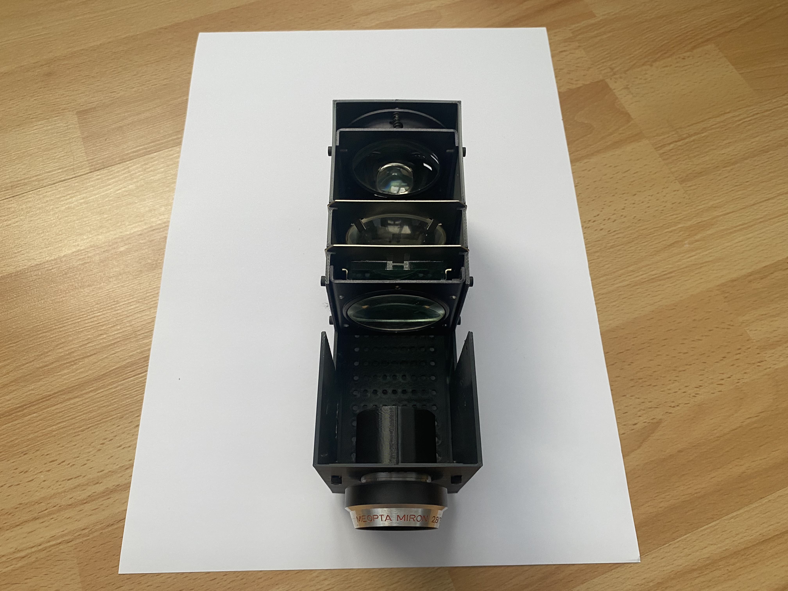

# 3d_printed_slide_projector_case
A 3D printed case for an old slide projector and all the optics inside. This was part of a school project where I replaced the original lightbulb with a smaller LED. Eventually I want to add an even stronger one with proper cooling. The original light source was getting hotter than what I'd be comfortable with, especially if it was left unattended.

